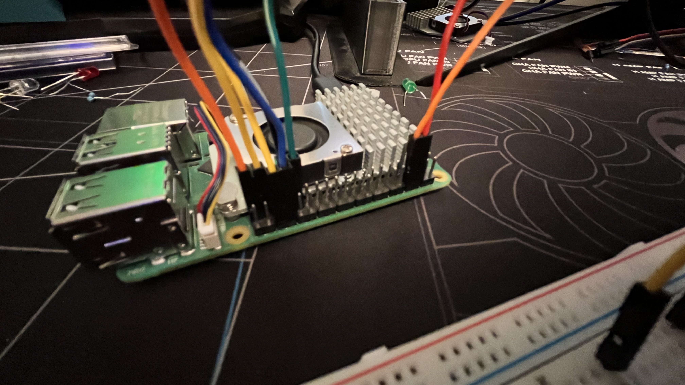

# Pi Keyboard

A custom breadboard keyboard using a Raspberry Pi that sends keyboard events to a PC over TCP.

## Hardware Setup

Connect momentary push buttons to the following GPIO pins on the Raspberry Pi:

- GPIO 26: Forward (W)
- GPIO 16: Left (A)
- GPIO 13: Down (S)
- GPIO 6: Right (D)
- GPIO 14: Space





## Software Setup

1. Install dependencies:

```bash
pip install gpiozero keyboard
```

2. On your PC:

```bash
python3 pc.py
```

3. On the Raspberry Pi:

- Edit `pi.py` and set `HOST` to your PC's IP address.
- Run the script:

  ```bash
  python3 pi.py
  ```

Press the buttons on the breadboard to send corresponding key events to your PC.